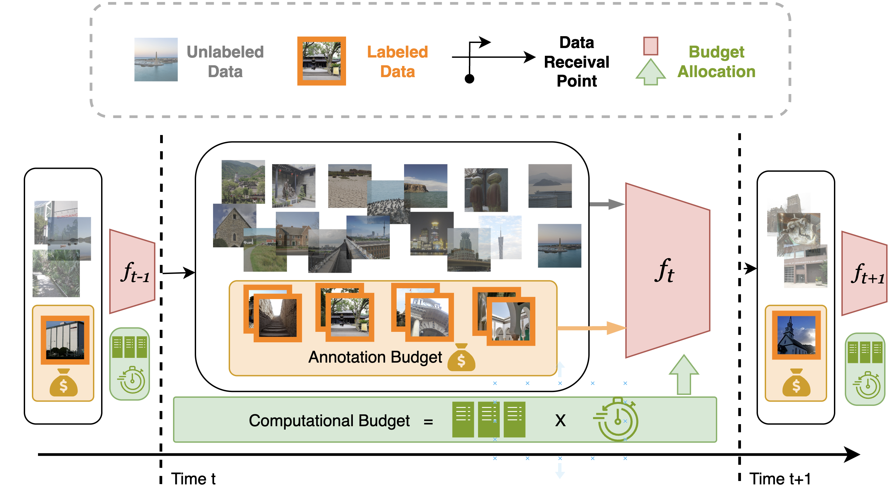

# Continual Learning on a Diet: Learning from Sparsely Labeled Streams Under Constrained Computation
This is the official PyTorch implementation for our ICLR 2024 paper, and for customizing the multi-GPU continual learning.

<div style="width:40% float:center diaplay:inline">
      &nbsp; &nbsp; 
</div>

<a target="_blank" href="https://arxiv.org/abs/2404.12766">

</a><a target="_blank" href="https://github.com/wx-zhang/continual-learning-on-a-diet">

<br>

<span style="color:#183385; font-size: 14pt; font-family: Roboto, Helvetica, Arial, Heveltica Neue, sans-serif">
     <b>Authors:</b> <a class="name" target="_blank" href="https://wx-zhang.github.io/">Wenxuan Zhang</a>, 
     <a class="name" target="_blank" href="https://scholar.google.com/citations?user=DtCLSdUAAAAJ&hl=en">Youssef Mohamed</a>,
     <a class="name" target="_blank" href="https://www.bernardghanem.com/">Bernard Ghanem</a>,
     <a class="name" target="_blank" href="https://www.robots.ox.ac.uk/~phst/">Philip Torr</a>,
     <a class="name" target="_blank" href="https://www.adelbibi.com/">Adel Bibi*</a>,
     <a class="name" target="_blank" href="https://www.mohamed-elhoseiny.com/">Mohamed Elhoseiny*</a>&nbsp; @ 
     <a class="btna" target="_blank" href="https://cemse.kaust.edu.sa/vision-cair/vision-cair">KAUST Vision-CAIR</a>, 
          <a class="btna" target="_blank" href="https://torrvision.com/index.html">Oxford TVG</a> &nbsp (* Equal Advising)&nbsp; 
     </span>


## Overview


<details><summary>Abstract</summary> 

- We propose and study a realistic Continual Learning (CL) setting where learning algorithms are granted a **restricted computational** budget per time step while training. 

- We apply this setting to large-scale semi-supervised Continual Learning scenarios with **sparse label rate**. Previous proficient CL methods perform very poorly in this challenging setting. Overfitting to the sparse labeled data and insufficient computational budget are the two main culprits for such a poor performance. 

- We propose a simple but highly effective baseline, **DietCL**, which utilizes both unlabeled and labeled data jointly. DietCL meticulously allocates computational budget for both types of data. 

- We **validate our baseline, at scale**, on several datasets, e.g., CLOC, ImageNet10K, and CGLM, under constraint budget setup. DietCL outperforms, by a large margin, all existing supervised CL algorithms as well as more recent continual semi-supervised methods. Our extensive analysis and ablations demonstrate that DietCL is stable under a full spectrum of label sparsity, computational budget and various other ablations.

</details>


## Usage

### Installation
```
conda env create -f environment.yml
conda activate dietcl
``` 
Follow this [issue](https://github.com/rwightman/pytorch-image-models/issues/420#issuecomment-776459842) to fix the library import problem.  


### Reproduce Results
TODO: 
- [ ] Hyper-parameters need to be updated
- [ ] Multi-node training need to be tested
#### ImageNet10K Results
To avoid repeatant long pre-processing time and for stable results and faster read, we suggest to pre-process the dataset once and save it as folders of symbolic links. Please follow the following steps to prepare the dataset:
1. download the imagenet 21k v2 dataset from the official [ImageNet Website](https://www.image-net.org/download-images.php). We use the Winter 2021 release, i.e., Processed version of ImageNet21Kusing the script of "ImageNet-21K pretraining for the masses"
2. Run the following script to prepare the dataset. Here we use three separate files to build the general imagenet10k, the task sequence, and the task labels for flexiable usage. 
```bash
python pre_process/get_unique_set.py --root21k /path/to/your/imagenet21k/folder
python pre_process/build_cl_tasks.py 
python pre_process/label_split.py
```
3. Run the following command to reproduce the results. 
```bash
python main.py trainer@_global_=diet dataset@_global_=imagenet10k n_gpu_per_node=8 data_root=/path/to/your/imagenet21k/folder
```

#### CGLM or CLOC Results
1. Download the CGLM dataset using the following script. 
```bash
bash pre_process/download_cglm.sh
```  
2. Run the following command to split the dataset
```bash
python pre_process/cglm|cloc.py --root /path/to/your/cglm|cloc/folder
```
3. Run the following command to reproduce the results. 
`data_path` refers to the path to the split files, and `data_root` refers to the path to the image files. 
```bash
python main.py trainer@_global_=diet dataset@_global_=cglm|cloc data_root=/path/to/your/cglm|cloc/folder data_path=/path/to/your/cglm|cloc/split/file/folder
```

## Customized Multi-GPU Continual Leanring
### Other continual learning methods 
1. Supervised continual learning with experience replay 
```bash
# mix the current set and buffer. Uniformly sampling from the buffer and current task 
python main.py trainer@_global_=base sampling=uniform  replay_before=True 
# Balanced sampling from buffer and the current labeled set for each batch.
python main.py trainer@_global_=base sampling=batchmix 
```

2. Continual pre-training and finetuning: pre-train and finetune for each tasks 
```bash
python main.py trainer@_global_=pretrain
```

### Customize your own continual learning methods
Customize your multi-gpu continual learning with this repo. 
1. Write your own dataset and put it in the `datasets` folder with the template 
```python
class YourDataset(Dataset):
     def __init__(self, args):
          pass
     def get_new_classes(self, task_id): # we need this function to adjust the classification head for the model
          pass
     def get_labeled_set(self,task):
          pass
     def get_eval_set(self,task,per_task_eval):
          # per_task_eval refers to whether we want to evaluate all tasks at once (for efficiency purpose) or evaluate each task separately.
          pass
```
2. Write your own trainer and put it in the `trainers` folder with the template 
3. Write your own model and put it in the `models` folder 

### CL + DDP trouble shooting
-  If slurm is used, please make sure to allocate enough CPU and CPU memory.

## Acknowledgement
We thank the authors of the following repositories for their great work:
- [MAE](https://github.com/facebookresearch/mae), [Multi-processing DDP](https://github.com/pytorch/examples/tree/main/imagenet)
- [Budgeted CL](https://github.com/drimpossible/BudgetCL), [Avalanche](https://github.com/ContinualAI/avalanche)
## Citation
If you find this work useful, please consider citing our paper:
```
@inproceedings{zhang2024continual,
  title={Continual Learning on a Diet: Learning from Sparsely Labeled Streams Under Constrained Computation},
  author={Zhang, Wenxuan and Mohamed, Youssef and Ghanem, Bernard and Torr, Philip and Bibi, Adel and Elhoseiny, Mohamed},
  booktitle={International Conference on Learning Representations},
  year={2024}
}
```